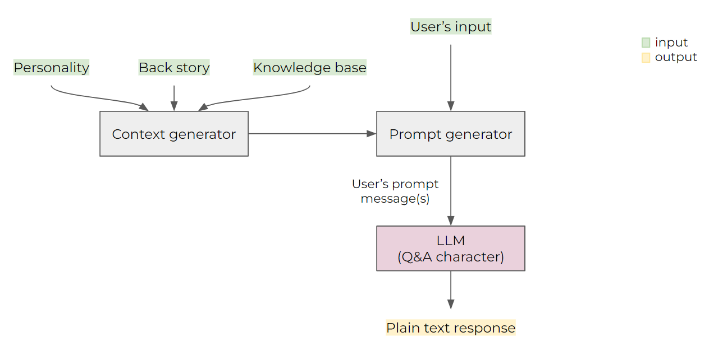

# LLM Demo - Talking Character

Talking Character is a voice chatbot-based web application that allows users to interact with a 3D character using natural language. Users can provide personality, back story, and knowledge base to this character. Talking Character is powered by PaLM, a large language model from Google. To interact with Talking Character, simply tap on the microphone button and speak to the character. Talking Character will respond to your speech.

Whether you're looking for a fun way to learn about PaLM, or you're interested in voice chatbot, Talking Character is the right demo for you!


## Table of contents

- [LLM Demo - Talking Character](#llm-demo---talking-agent)
  - [Table of contents](#table-of-contents)

  - [How it works](#how-it-works)
    - [LLM's prompt design](#llms-prompt-design)
    - [Context generator](#context-generator)
    - [Prompt generator](#prompt-generator)
    - [LLM's response](#llms-response)
  - [How to install](#how-to-install)
    - [Available Scripts](#available-scripts)
  - [Learn More](#learn-more)
  - [Contributors](#contributors)


## How it works

### LLM's prompt design



### Context generator

Context is used to give the LLM a better understanding of the conversation. Here is the structure of the context (preamble):

```js
{
  context: `Your task is to acting as a character that has this personality: "${config.state.personality}". Your response must be based on your personality. You have this backstory: "${config.state.backStory}". Your knowledge base is: "${config.state.knowledgeBase}". The response should be one single sentence only.`;
}
```

- The `personality` is a string variable that describes the character's personality traits.
- The `backStory` is a string variable that describes the character's back story.
- The `knowledgeBase` is a string variable that describes the facts that the character would know.

### Prompt generator

In every user's turn, the user's input message `${message}` will be formatted into this structure:

```js
{
    author: '0',
    content: `Please answer within 100 characters. {${message}}. The response must be based on the personality, backstory, and knowledge base that you have. The answer must be concise and short.`
}
```

- The `message` is the user's input message.

Combined with the context, here is the final structure of the prompt sending to the LLM:

```js
{
    prompt: {
        context: `Your task is to acting as a character that has this personality: "${config.state.personality}". Your response must be based on your personality. You have this backstory: "${config.state.backStory}". Your knowledge base is: "${config.state.knowledgeBase}". The response should be one single sentence only.`,
        messages: [
            {
                author: '0',
                content: `Please answer within 100 characters. {${message}}. The response must be based on the personality, backstory, and knowledge base that you have. The answer must be concise and short.`
            },
            ...
        ]
    },
    temperature: 0.25,
    candidate_count: 1,
}
```

- The `messages` is an array of chat messages from past to present alternating between the user (author=0) and the LLM (author=1). The first message is always from the user.
- The `temperature` is a float number between 0 and 1. The higher the temperature, the more creative the response will be. The lower the temperature, the more likely the response will be a correct one.
- The `candidate_count` is the number of responses that the LLM will return.

### LLM's response

The output of the LLM is in this structure:

```js
{
    candidates: [
        {
            author: '1',
            content: 'This is the response content from the LLM.'
        }
    ],
    messages: [
        ...
    ]
}
```

- The `candidates` is an array of responses from the LLM. This project has only one response per turn (as candidate_count=1).
- The `messages` is an array of chat messages from past to present alternating between the user (author=0) and the LLM (author=1). The first message is always from the user.


## How to install
This project was bootstrapped with [Create React App](https://github.com/facebook/create-react-app).

### Available Scripts

In the project directory, you can run:

### `npm start`

Runs the app in the development mode.\
Open [http://localhost:3000](http://localhost:3000) to view it in the browser.

The page will reload if you make edits.\
You will also see any lint errors in the console.

### `npm test`

Launches the test runner in the interactive watch mode.\
See the section about [running tests](https://facebook.github.io/create-react-app/docs/running-tests) for more information.

### `npm run build`

Builds the app for production to the `build` folder.\
It correctly bundles React in production mode and optimizes the build for the best performance.

The build is minified and the filenames include the hashes.\
Your app is ready to be deployed!

See the section about [deployment](https://facebook.github.io/create-react-app/docs/deployment) for more information.

### `npm run eject`

**Note: this is a one-way operation. Once you `eject`, you can’t go back!**

If you aren’t satisfied with the build tool and configuration choices, you can `eject` at any time. This command will remove the single build dependency from your project.

Instead, it will copy all the configuration files and the transitive dependencies (webpack, Babel, ESLint, etc) right into your project so you have full control over them. All of the commands except `eject` will still work, but they will point to the copied scripts so you can tweak them. At this point you’re on your own.

You don’t have to ever use `eject`. The curated feature set is suitable for small and middle deployments, and you shouldn’t feel obligated to use this feature. However we understand that this tool wouldn’t be useful if you couldn’t customize it when you are ready for it.

## Learn More

You can learn more in the [Create React App documentation](https://facebook.github.io/create-react-app/docs/getting-started).

To learn React, check out the [React documentation](https://reactjs.org/).


## Contributors

- Mattias Breitholtz
- Pedro Vergani
- Yinuo Wang
- Christian Frueh
- Vivek Kwatra
- Boon Panichprecha
- Lek Pongsakorntorn
- Zeno Chullamonthon
- Yiyao Zhang
- Qiming Zheng
- Joyce Li
- Xiao Di
- KC Chung
- Jay Ji

## Disclaimer

This demo uses synthesized video and speech to make it more natural for users to interact with language models. The avatar used in this demo does not represent a real person or human being.
